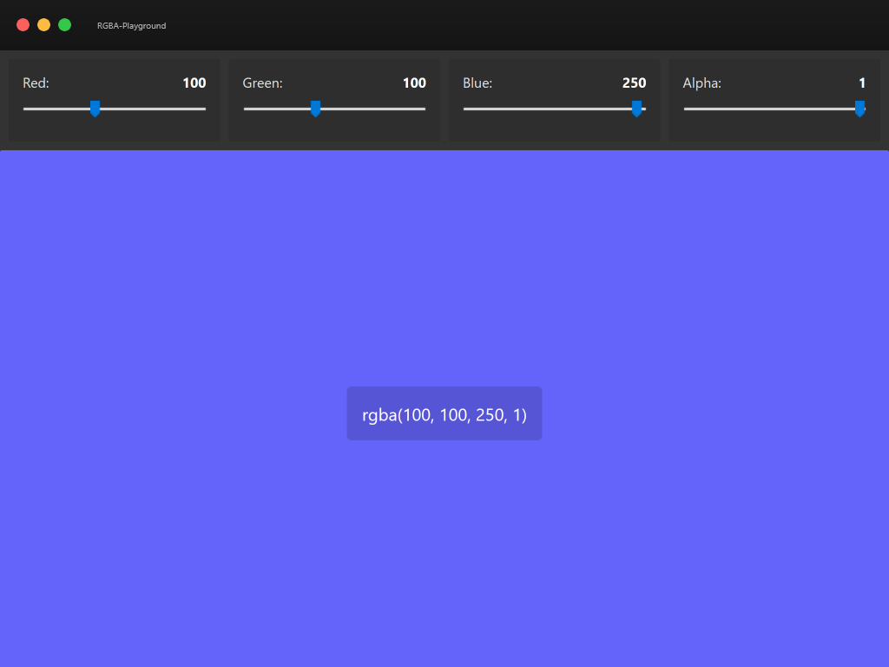

# rgba-playground

Outil en ligne pour générer une couleur RGB/RGBA

## Demo

[https://cedricbeau.github.io/rgba-playground/](https://cedricbeau.github.io/rgba-playground/)

**Mise à jour 25/04/2020**

* Ajout de la capture d'écran
* Ajout du mode Offline
* Ajout de la font icon Icomoon
* Refactorisation de l'architecture CSS
* Ajout du .gitignore

**Mise à jour 08/12/2018**

* Changement du favicon

**Mise à jour 25//11/2018**

* RGBA Selector devient RGBA Playground
* Ajout du dossier favicon

**Mise à jour 22/10/2018**

* Suppression du reset
